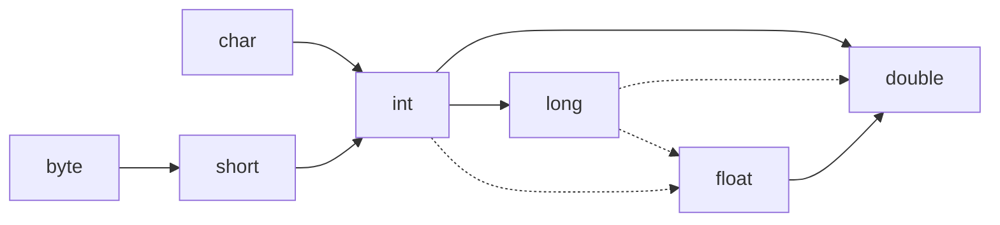
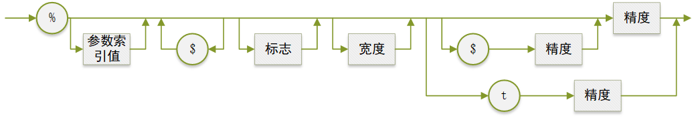

[TOC]

<div STYLE="page-break-after: always;"></div>

# 第3章 Java的基本程序设计结构

| $\blacktriangle$ [一个简单的Java应用程序](#3.1 一个简单的Java应用程序) | $\blacktriangle$ [3.6 字符串](#3.6 字符串) |
| ------------------------------------------------------------ | ------------------------------------------ |
| $\blacktriangle$ [注释](#3.2 注释)                           | $\blacktriangle$ [输入输出](#3.7 输入输出) |
| $\blacktriangle$ [数据类型](#3.3 数据类型)                   | $\blacktriangle$ [控制流程](#3.8 控制流程) |
| $\blacktriangle$ [变量](#3.4 变量)                           | $\blacktriangle$ [大数值](#3.9 大数值)     |
| $\blacktriangle$ [运算符](#3.5 运算符)                       | $\blacktriangle$ [数组](#3.10 数组)        |

## 3.1 一个简单的Java应用程序

一个最简单的 Java 应用程序

```java
public class FirstSample {
    public static void main(String[] args) {
        System.out.println("We will not use 'Hello, World!"') ;
    }
}
```

* Java 区分大小写

* 关键字 `public`
  称为访问修饰符 (access modifier)， 些修饰符用于控制程序的其他部分对这段代码的访问级別。
  
* 关键字 `class` 
  表明 Java 程序中的全部内容都包含在类中。
  
* 关键字 `class` 后面紧跟==类名==名字必须以字母开头，后面可以跟字母和数字的任意组合。不能使用 Java 保留字(保留字列表请参看 [附录 A](Java关键字.md) )

* 标准的命名规范
  类名是以大写字母开头的名词。如果名字由多个单词组成，每个单词的第一个字母都应该大写（这种在一个单词中间使用大写字母的方式称为胳蛇命名法）。

* 源代码的文件名必须与公共类的名字相同，并用==.java==作为扩展名。

:page_facing_up: 注释：根据 Java 语言规范，`main` 方法必须声明为 `public`  ( Java 语言规范是描述 Java 语言的官方文档。可以从[网站](http://docs.oracle.com/javase/specs)上阅读或下载）。

* 需要注意源代码中的括号`{` `}`。在 Java 中，像在 C/C++ 中一样，用大括号划分程序的各个部分（通常称为块)。Java 中任何方法的代码都用 =={== 开始，用 ==}==结束。

* 每个 Java 应用程序都必须有一个 ==main== 方法，其声明格式如下所示：


```java
public class ClassName {
    public static void main(String口 args) {
        // program statements
    }
}
```

## 3.2 注释

* 在 Java 中，有 3 种标记注释的方式。最常用的方式是使用`//`，`//`其注释内容从 `//` 开始到本行结尾。`System.out.println("We will not use 'Hello, World!"）；// is this too cute?`
* 当需要长篇的注释时， 既可以在每行的注释前面标记 `//`，`/*` 也可以使用 `/*` 和 `*/` 将一段比较长的注释括起来。
* 最后，第 3 种注释可以用来自动地生成文档。这种注释以 `/**` 开始， 以 `*/` 结束。请参见==程序清单 3-1==。有关这种注释的详细内容和自动生成文档的具体方法请参见[第 4 章](第4章 对象与类.md)。

==程序清单 3-1 FirstSample/FirstSample.java==

```java
package FirstSample;

/**
 * This the first sample program in Core Java Chapter 3
 * @author Gary Cornell
 * @version 1.01 1997-03022
 */
public class FirstSample {
    public static void main(String[] args) {
        String greeting = "Hello";

        int length = greeting.length();
        char first = greeting.charAt(0);    // first is 'H'
        char last = greeting.charAt(4);        // last is '0'

        // 得到实际的长度，即码点数量
        int cpCount = greeting.codePointCount(0, greeting.length());

        System.out.println("We will not use 'Hello World'");
        System.out.println(String.join(" / ", "S", "M", "L", "XL"));
        System.out.println(greeting.substring(0, 3) + "p!");
        System.out.println("Hello".equals(greeting));
        System.out.println("Hello".equalsIgnoreCase("hello"));
        System.out.println(greeting.compareTo("Hello") == 1);
        System.out.println("length = " + length
                + ", fist char is " + first
                + ", last char is " + last);
        System.out.println(cpCount);

        // 得到第 i 个码点
        for (int i = 0; i < length; i++) {
            int index = greeting.offsetByCodePoints(0, i);
            int cp = greeting.codePointAt(index);
            System.out.print(cp + " / ");
        }
        System.out.println();

        int[] codePoints = greeting.codePoints().toArray();
        String str = new String(codePoints, 0, codePoints.length);
        for (int i = 0; i < length; i++)
            System.out.print(codePoints[i] + " / ");
        System.out.println("\n" + str);

        char ch = ' ';
        StringBuilder builder = new StringBuilder();
        builder.append(ch);
        builder.append(str);
        System.out.println(ch + str);

        String completedString = builder.toString();
        System.out.println(completedString);
    }
}
```

:warning::警告：在 Java 中，`/* */`注释不能嵌套。也就是说，不能简单地把代码用 `/*` 和 `*/` 括起来作为注释， 因为这段代码本身可能也包含一个 `*/`

## 3.3 数据类型

&emsp;&emsp;Java 是一种强类型语言。这就意味着必须为每一个变量声明一种类型。在 Java 中，一共有 8 种基本类型 (primitive type)， 其中有 4 种[整型](#3.3.1 整型)、2 种[浮点类型](#3.3.2 浮点类型)、 1 种用于表示 [Unicode](#3.3.4 Unicode和char类型) 编码的字符单元的 字符类型 [char](#3.3.3 char类型) 和 1 种用于表示真值的 [boolean](#3.3.5 boolean类型) 类型。

:page_facing_up: Java 有一个能够表示任意精度的算术包，通常称为“大数值”(bignumber)。 虽然被称为[大数值](#3.9 大数值)，但它并不是一种新的 Java 类型， 而是一个 Java 对象。

### 3.3.1 整型

整型用于表示没有小数部分的数值，它允许是负数。Java 提供了 4 种整型

|  类型   | 存储需求 |                  取值范围                   |
| :-----: | :------: | :-----------------------------------------: |
|  `int`  |  4 字节  |  -2147483648 ~ 2147483647 (正好超过 20 亿)  |
| `short` |  2 字节  |               -32768 ~ 32768                |
| `long`  |  8 字节  | -9223372036 854775B08 ~ 9223372036854775807 |
| `byte`  |  1 字节  |                 -128 ~ 127                  |

* 在通常情况下，int 类型最常用。但如果表示星球上的居住人数，就需要使用 long 类型了。byte 和 short 类型主要用于特定的应用场合，例如，底层的文件处理或者需要控制占用存储空间量的大数组。
* 在 Java 中，整型的范围与运行 Java 代码的机器无关。
* 长整型数值有一个后缀 L 或 1 ( 如 4000000000L。) 十六进制数值有一个前缀 0x 或 0X (如 0xCAFEL) 八进制有一个前缀 0 , 例如， 010 对应八进制中的 8。
* 从 Java 7 开始， 加上前缀 0b 或 0B 就可以写二进制数，还可以为数字字面量加下划线。

:warning:Java 没有任何无符号（`unsigned`) 形式的 `int`、`long`、`short` 或 `byte` 类型。

### 3.3.2 浮点类型

浮点类型用于表示有小数部分的数值。

|   类型   | 存储需求 |                       取值范围                       |
| :------: | :------: | :--------------------------------------------------: |
| `float`  |  4 字节  |   大约 $\pm3.40282347E+38F$ (有效位数为 6 ~ 7 位)    |
| `double` |  8 字节  | 大约$\pm1.79769313486231570E+308$ (有效位数为 15 位) |

* `double`表示这种类型的数值精度是`float`类型的两倍(有人称之为双精度数值)。绝大部分应用程序都采用`double`类型。在很多情况下，`float`类型的精度很难满足需求。实际上，只有很少的情况适合使用`float`类型，例如，需要单精度数据的库，或者需要存储大量数据。
* `float`类型的数值有一个后缀`F`或`f`。没有后缀`F`的浮点数值默认为`double`类型，也可以在浮点数值后面添加后缀`D`或`d`。

:page_facing_up: 注释：可以使用十六进制表示浮点数值。例如，$0.125=2^{-3}$ 可以表示成$0x1.0p^{-3}$。在十六进制表示法中，使用==p==表示指数，而不是==e==。注意，尾数采用十六进制，指数采用十进制。指数的基数是 2， 而不是 10。

用于表示溢出和出错情况的三个特殊的浮点数值：

* 正无穷大

* 符无穷大

* NaN(不是一个数字)

:page_facing_up: 常量`Double_POSITIVE_INFINITY`、`Double.NEGATIVEJNFINITY` `Double.NaN`(以及相应的`Float`类型的常量) 分别表示这三个特殊的值，但在实际应用中很少遇到。特别要说明的是，不能这样检测一个特定值是否等于 Double.NaN:
  `if (x = Double.NaN) // is never true`
所有“ 非数值” 的值都认为是不相同的。然而，可以使用`Double.isNaN`方法：
  `if (Double.isNaN(x)) // check whether x is "not a number"`

:warning:浮点数值不适用于无法接受舍入误差的金融计算中。这种舍入误差的主要原因是浮点数值采用二进制系统表示，而在二进制系统中无法精确地表示分数。如果在数值计算中不允许有任何舍入误差，就应该使用`BigDecimal`类。

### 3.3.3 char类型

* `char`类型原本用于表示单个字符。不过，现在情况已经有所变化。 如今，有些 Unicode字符可以用一个`char`值描述， 另外一些 Unicode 字符则需要两个`char`值。
* `char`类型的字面量值要用单引号括起来。 `char`类型的值可以表示为十六进制值，其范围从==\u0000==到==\Uffff==。
* 除了转义序列 \u 之外， 还有一些用于表示特殊字符的转义序列。所有这些转义序列都可以出现在加引号的字符字面量或字符串中。
特殊字符的转义序列

| 转义序列 | 名称  | Unicode 值 | 转义序列 |  名称  | Unicode 值 |
| :------: | :---: | :--------: | :------: | :----: | :--------: |
|   `\b`   | 退格\ |   \u0008   |   `\"`   | 双引号 |   \u0022   |
|   `\r`   | 制表  |   \u0009   |   `\'`   | 单引号 |   \u0027   |
|   `\n`   | 换行  |   \u000a   |   `\\`   | 反斜杠 |   \u005c   |
|   `\r`   | 回车  |   \u000b   |          |        |            |

:warning:Unicode 转义序列会在解析代码之前得到处理。 

### 3.3.4 Unicode和char类型

### 3.3.5 boolean类型

boolean (布尔）类型有两个值：`false`和`true`, 用来判定逻辑条件整型值和布尔值之间不能进行相互转换。

## 3.4 变量

* 在 Java 中，每个变量都有一个类型 (type)。在声明变量时，变量的类型位于变量名之前。
* 声明是一条完整的 Java 语句，必须以分号结束。
* 变量名必须是一个以字母开头并由字母或数字构成的序列。字母包括=='A' ~ 'Z'、 'a' ~ 'z'、'-'、'$'==或在某种语言中表示字母的任何 Unicode 字符。但 '+' 和 ':copyright:'这样的符号不能出现在变量名中，空格也不行。变量名中所有的字符都是有意义的，并且大小写敏感。变量名的长度基本上没有限制。

:heavy_check_mark:提示：如果想要知道哪些 Unicode 字符属于 Java 中的“字母”， 可以使用`Character`类的`isJavaldentifierStart`和`isJavaldentifierPart`方法来检查。
:heavy_check_mark:提示：尽管`$`是一个合法的 Java 字符， 但不要在你自己的代码中使用这个字符。 它只用在 Java 编译器或其他工具生成的名字中。
       另外， 不能使用 Java 保留字作为变量名(请参看中[附录 A](Java关键字.md)的保留字列表)。
       可以在一行中声明多个变量。不过，不提倡使用这种风格。逐一声明每一个变量可以提高程序的可读性。

:page_facing_up: 注释：如前所述，变量名对大小写敏感，在对两个不同的变量进行命名时，最好不要只存在大小写上的差异。 许多程序员将变量名命名为类型名，还有一些程序员更加喜欢在变量名前加上前缀" a"。

### 3.4.1 变量初始化

* 声明一个变量之后，必须用赋值语句对变量进行显式初始化，千万不要使用未初始化的变量。
* 要想对一个已经声明过的变量进行赋值，就需要将变量名放在等号(=) 左侧，相应取值的 Java 表达式放在等号的右侧。也可以将变量的声明和初始化放在同一行中。最后，在 Java 中可以将声明放在代码中的任何地方。
* 在 Java 中， 变量的声明尽可能地靠近变量第一次使用的地方，这是一种良好的程序编写风格。

### 3.4.2 常量

* 在 Java 中，变量的声明尽可能地靠近变量第一次使用的地方，这是一种良好的程序编写风格。
* 关键字`final`表示这个变量只能被赋值一次。一旦被赋值之后，就不能够再更改了。习惯上，常量名使用全大写。
* 在 Java 中，经常希望某个常量可以在一个类中的多个方法中使用，通常将这些常量称为类常量。可以使用关键字`static final`设置一个类常量。需要注意，类常量的定义位于`main`方法的外部。因此，在同一个类的其他方法中也可以使用这个常量。 而且，如果一个常量被声明为 public，那么其他类的方法也可以使用这个常量。

## 3.5 运算符

* 在 Java 中，使用算术运算符`+`、`-`、`*`、`/`表示加、减、乘、除运算。当`参与/运算`的两个操作数都是整数时，表示整数除法；否则，表示浮点除法。整数的求余操作(有时称为取模)用`％`表示。
* 当`参与/运算`的两个操作数都是整数时， 表示整数除法；否则， 表示浮点除法。 整数的求余操作有时称为取模)用`％`表示。 

### 3.5.1 数学函数与常量

* 在 Math 类中，包含了各种各样的数学函数。在编写不同类别的程序时，可能需要的函数也不同。
* 在 Java 中，没有幂运算， 因此需要借助于 Math 类的 pow 方法。
  ​ `double y = Math.pow(a, b)`

将 y 的值设置为 a 的 b 次幂($a^b$)。pow 方法有两个`double`类型的参数，其返回结果也为`double`类型。
      floorMod 方法关于负数，例如，在 Java 中对于负除数，floorMod 会得到负数结果$-7\  \%\ 3 = -1, \ 7\ \%\ 3 = 1$

* Math 类提供了一些常用的三角函数：

> Math.sin
> Math.cos
> Math.tan
> Math.atan
> Math.atan2

* 还有指数函数以及它的反函数—自然对数以及以 10 为底的对数：

> Math.exp
> Math.log
> Math.log10

* 最后，Java 还提供了两个用于表示$\pi$和$\mathrm{e}$常量的近似值：

> Math.PI
> Math.E

:page_facing_up: 注释：在 Math 类中，为了达到最快的性能，所有的方法都使用计算机浮点单元中的例程。如果得到一个完全可预测的结果比运行速度更重要的话，那么就应该使用`StrictMath`类。

### 3.5.2 数值类型之间的转换




### 3.5.3 强制类型转换

&emsp;&emsp;强制类型转换的语法格式是在圆括号中给出想要转换的目标类型，后面紧跟待转换的变量名。

:warning:如果试图将一个数值从一种类型强制转换为另一种类型， 而又超出了目标类型的表示范围， 结果就会截断成一个完全不同的值。

### 3.5.4 结合赋值和运算符

&emsp;&emsp;可以在赋值中使用二元运算符，这是一种很方便的简写形式。(一般地，要把运算符放在`=` 号左边)

:page_facing_up:注释：如果运算符得到一个值，其类型与左侧操作数的类型不同， 就会发生强制类型转换。

### 3.5.5 自增与自减运算符

* “后缀”形式：
  `n++`或`n--`使用变量原来的值 。
* “前缀”形式：`++n`或`--n`会先完成 +1或 -1

建议不要在表达式中使用 ++，因为这样的代码很容易让人闲惑，而且会带来烦人的 bug。

### 3.5.6 关系和boolean运算符

* 要检测相等性，可以使用两个等号`==`。另外可以使用`!=` 检测不相等。
* 还有经常使用的 `<` 、`>` 、`<=`和 `>=` 运算符。
* 使用`&&`表示逻辑“与”运算符，使用`||`表示逻辑“或”运算符，`!`就是逻辑非运算符。`&&`和`||`运算符是按照“ 短路” 方式来求值的。三元操作符`? :`

### 3.5.7 位运算符

&emsp;&emsp;处理整型类型时，可以直接对组成整型数值的各个位完成操作。这意味着可以使用掩码技术得到整数中的各个位。位运算符包括：`&` ("and")   `|` ("or")  `^`  ("XOr")   `~` ("not")

:page_facing_up:注释：应用在布尔值上时，`&`和`|`运算符也会得到一个布尔值。这些运算符与`&&`和`||`运算符很类似，不过`&`和`|`运算符不采用 短路”方式来求值，也就是说，得到计算结果之前两个操作数都需要计算。

还有`>>`和`<<`运算符将位模式左移或右移。需要建立位模式来完成位掩码时，这两个运算符会很方便。

:warning:警告：移位运算符的右操作数要完成模 32 的运算(除非左操作数是`long`类型，在这种情况下需要对右操作數模 64)。

### 3.5.8 括号与运算符级别

运算符优先级表(从高到低:arrow_down:)

|                 运  算  符                 |  结合性  |
| :----------------------------------------: | :------: |
|                 `[] . ()`                  | 从左向右 |
| `! ~ ++ -- new`   `+ -`[^1]`()`[^2]  `new` | 从左向右 |
|                  `* / %`                   | 从左向右 |
|                   `+ -`                    | 从左向右 |
|                `<< >> >>>`                 | 从左向右 |
|         `< <= > >=`  `instanceof`          | 从左向右 |
|                  `== !=`                   | 从左向右 |
|                    `&`                     | 从左向右 |
|                    `^`                     | 从左向右 |
|                    `|`                     | 从左向右 |
|                    `&&`                    | 从左向右 |
|                    `||`                    | 从左向右 |
|                   `? :`                    | 从右向左 |
|   `= += -= *= /= %= |= ^= <<= >>= >>>=`    | 从右向左 |

[^1]: 一元运算符，即用做取正(负)

[^2]: 强制转换

### 3.5.9 枚举类型

&emsp;&emsp;有时候，变量的取值只在一个有限的集合内。有关枚举类型的详细内容将在[第 5 章](第5章 继承.md)介绍。

## 3.6 字符串

&emsp;&emsp;从概念上讲，Java 字符串就是 Unicode 字符序列。Java 没有内置的字符串类型， 而是在标准 Java 类库中提供了一个预定义类， 很自然地叫做`String`。每个用双引号括起来的字符串都是 String类的一个实例。

## 3.6.1 子串

&emsp;&emsp;String 类的`substring`方法可以从一个较大的字符串提取出一个子串(取左不取右)。

### 3.6.2 拼接

&emsp;&emsp;Java 语言允许使用`+`号连接（拼接）两个字符串。当将一个字符串与一个非字符串的值进行拼接时，后者被转换成字符串。

### 3.6.3 不可变字符串

* String 类没有提供用于修改字符串的方法。可以通过拼接来创建一个新字符串的但效率不高。 不可变字符串却有一个优点：编译器可以让字符串共享。
* 为了弄清具体的工作方式，可以想象将各种字符串存放在公共的存储池中。字符串变量指向存储池中相应的位置。如果复制一个字符串变量， 原始字符串与复制的字符串共享相同的字符。

### 3.6.4 检测字符串是否相等

* 可以使用`equals`方法检测两个字符串是否相等。对于表达式：`s.equal.(t)`。
* 不区分大小写，可以使用`equalsIgnoreCase`方法。
* 一定不要使用`==`运算符检测两个字符串是否相等！这个运算符只能够确定两个字串是否放置在同一个位置上。当然，如果字符串放置在同一个位置上，它们必然相等。但是，完全有可能将内容相同的多个字符串的拷贝放置在不同的位置上。
* 如果虚拟机始终将相同的字符串共享， 就可以使用`==`运算符检测是否相等。但实际上只有字符串常量是共享的，而`+`或`substring`等操作产生的结果并不是共享的。

### 3.6.5 空串与Null串

* 空串`""`是长度为 0 的字符串。可以调用以下代码检查一个字符串是否为空：
`if(str.length() == 0)`或`if(str.equals(""))`

* 空串是一个 Java 对象，有自己的串长度(0)和内容(空)。不过，String 变量还可以存放一个特殊的值，名为==null==，这表示目前没有任何对象与该变量关联(关于 null 的更多信息请参见[第 4 章](#第4章 对象与类))。
* 要检查一个字符串是否为 null，要使用以下条件：
  if (str == null)
* 有时要检查一个字符串既不是 null 也不为空串，这种情况下就需要使用以下条件：
  `if (str != null && str.length() != 0)`
  首先要检查 str 不为 null。在[第 4 章](#第4章 对象与类)会看到，如果在一个 mill 值上调用方法， 会出现错误。

### 3.6.6 码点与代码单元

* length 方法将返回采用 UTF-16 编码表示的==给定字符串所需要的代码单元数
  `str.length()`

* 要想得到实际的长度，即码点数量，
  `str.codePointCount(0, greeting.length())`

* 调用`s.charAt(n)`将返回位置 n 的代码单元，n 介于0 $\sim$ s.length() $- 1$之间。  

* 要想得到第 i 个码点
  `str.codePointAt(greeting.offsetByCodePoints(0, i))`

* 如果想要遍历一个字符串，并且依次査看每一个码点

  ```java
  int cp = sentence.codePointAt(i)
  if (Character.isSupplementaryCodePoint(cp))i += 2;
  else i++;
  ```

  可以使用下列语句实现回退操作：

  ```java
  i--;
  if (CharacterssSurrogate(sentence.charAt(i))) i--;
  int cp = sentence.codePointAt(i);
  ```

* 显然，这很麻烦。更容易的办法是使用`codePoints`方法，它会生成一个 int 值的“流”，每个 int 值对应一个码点。可以将它转换为一个数组，再完成遍历。
  `int[] codePoints = str.codePoints().toArray();`
* 反之，要把一个码点数组转换为一个字符串，可以使用构造函数。
  `String str = new String(codePoints, 0, codePoints.length);`

### 3.6.7 String API

==java.lang.string==

| 方法<br/>说明                                                |
| ------------------------------------------------------------ |
| `char charAt(int index)`<br/>返回给定位置的代码单元。除非对底层的代码单元感兴趣， 否则不需要调用这个方法。 |
| `codePointAt(int index)`<br/>返回从给定位置开始的码点。      |
| `offsetByCodePoints(int index, int codePointOffset)`<br/>返回从 index 代码点开始，位移 codePointOffset 后的码点索引。 |
| `compareTo(String anotherString)`<br/>按照字典顺序，如果字符串位于 anotherString 之前，返回一个负数；如果字符串位于 anotherString 之后，返回一个正数；如果两个字符串相等，返回 0。 |
| `codePoints()`<br/>将这个字符串的码点作为一个流返回。调用 toArray 将它们放在一个数组中。 |
| `String(int[] codePoints, int offset, int count)`<br/>用数组中从 offset 开始的 count 个码点构造一个字符串。 |
| `boolean equals(Object anObject)`<br/>如果字符串与 anObject 相等， 返回 `true`。 |
| `boolean equalsIgnoreCase(String anotherString)`<br/>如果字符串与 anotherString 相等， 返回 `true`。 |
| `startsWith(String prefix)`                                  |
| `endsWith(String suffix)`<br/>如果字符串以 suffix 开头或结尾，则返回`true`。 |
| `int indexOf(String str)`                                    |
| `int indexOf(String str, int fromIndex)`                     |
| `int indexOf(int ch)`                                        |
| `int indexOf(int ch, int fromIndex)`<br/>返回与字符串 str 或代码点 ch 匹配的第一个子串的开始位置。这个位置从索引 0 或 fromIndex 开始计算。 如果在原始串中不存在 str，返回 -1。 |
| `int lastIndexOf(String str)`                                |
| `int lastIndexOf(String str, int fromIndex)`                 |
| `int lastIndexOf(int ch)`                                    |
| `int lastIndexOf(int ch, int fromIndex)`<br/>返回与字符串 str 或代码点 cp 匹配的最后一个子串的开始位置。这个位置从原始串尾端或 fromlndex 开始计算。 |
| `int length()`<br/>返回字符串的长度。                        |
| `int codePointCount(int beginIndex, int endIndex)`<br/>返回 startlndex 和 endlndex $- 1$ 之间的代码点数量。没有配成对的代用字符将计入代码点。 |
| `String replace(CharSequence target, CharSequence replacement)`<br/>返回一个新字符串。这个字符串用 newString 代替原始字符串中所有的 oldString。可以用 String 或 StringBuilder 对象作为 CharSequence 参数。 |
| `String substring(int beginIndex)`                           |
| `String substring(int beginIndex, int endIndex)`<br/>返回一个新字符串。这个字符串包含原始字符串中从 beginlndex 到串尾或 endlndex $- 1$的所有代码单元。 |
| `String toLowerCase()` `String toUpperCase()`<br/>返回一个新字符串。这个字符串将原始字符串中的大写字母改为小写，或者将原始字符串中的所有小写字母改成了大写字母。 |
| `String trim()`<br/>返回一个新字符串。这个字符串将删除了原始字符串头部和尾部的空格。 |
| `String join(CharSequence delimiter, CharSequence... elements`)<br/>返回一个新字符串， 用给定的定界符连接所有元素。 |

:page_facing_up:注释：在 API 注释中，有一些 CharSequence 类型的参数这是一种接口类型，所有字符串都属于这个接口。

### 3.6.8 阅读联机API文档

&emsp;&emsp;使用在线 API 文档十分重要，从中可以查阅到标准类库中的所有类和方法。API文档是 JDK 的一部分，它是 HTML 格式的。

### 3.6.9 构建字符串

使用 StringBuilder 类，构建较短的字符串构建字符串。

首先， 构建一个空的字符串构建器：
`StringBuilder builder = new StringBuilder();`
当每次需要添加一部分内容时， 就调用 append 方法：
`builder.append(ch); // appends a single character`
`bui1der.append(str); // appends a string`
在需要构建字符串时就凋用 toString 方法，将可以得到一个 String 对象，其中包含了构建器中的字符序列。
`String completedString = builder.toString(); `

下面的 API 注释包含了==StringBuilder 类中的重要方法==。java.lang.StringBuilde

| 方法<br/>说明                                                |
| ------------------------------------------------------------ |
| `StringBuilder()`<br/>构造一个空的字符串构建器。             |
| `int length()`<br/>返回构建器或缓冲器中的代码单元数量。      |
| `StringBuilder append(String str)`<br/>追加一个字符串并返回 this 。 |
| `StringBuilder append(char c)`<br/>追加一个字符串并返回 this 。 |
| `StringBuilder appendCodePoint(int codePoint)`<br/>追加一个代码点，并将其转换为一个或两个代码单元并返回 this。 |
| `void setCharAt(int index, char ch)`<br/>将第 i 个代码单元设置为 ch。 |
| `StringBuilder insert(int offset, String str)`<br/>在 offset 位置插入一个字符串并返回 this。 |
| `StringBuilder insert(int offset, char c)`<br/>在 offset 位置插入一个代码单元并返回 this。 |
| `StringBuilder delete(int start, int end)`<br/>删除偏移量从 startindex 到 -endlndex-1 的代码单元并返回 this。 |
| `String toString()`<br/>返回一个与构建器或缓冲器内容相同的字符串。 |

## 3.7 输入输出

&emsp;&emsp;为了增加后面示例程序的趣味性，需要程序能够接收输入，并以适当的格式输出。

### 3.7.1 读取输入

* 要想通过控制台进行输人，首先需要构造一个 Scanner 对象，并与“标准输人流” System.in关联。
  `Scanner in = new Scanner(Sysetm.in)`
* 使用 Scanner 类的各种方法实现输入操作了。例如`next.Line()`
  `String str = in.nextLine()`
* 使用 nextLine 方法是因为在输人行中有可能包含空格。要想读取一个单词(以空白符作为分隔符)，就调用
  `String str = in.next()`
* 要想读取一个整数，就调用`nextlnt`方法。
  `int num = in.next()`
* 与此类似，要想读取下一个浮点数，就调用`nextDouble`方法。

==Scanner 类定义在java.util 包中。==

==程序清单 3-2 InputTest/InputTest.java==

```java
package InputTest;

import java.util.Date;
import java.util.Scanner;

/**
 * This program demonstrates console input
 *
 * @author Cay Horstmann
 * @version 1.1. 2004-02-10
 */
public class InputTest {
    public static void main(String[] args) {
        Scanner in = new Scanner(System.in);

        // get first input
        System.out.println("What's your name?");
        String name = in.nextLine();

        // get second input
        System.out.println("How old are your?");
        int age = in.nextInt();

        // display output on console
        System.out.println("Hello, " + name + ". Next year, you'll be " + (age + 1));
        System.out.printf("Hello, %s. Next year, you'll be %d\n", name, age + 1);
        System.out.printf("%,.2f\n", 10000000.0 / 3.0);
        System.out.printf("%tc\n", new Date());
        System.out.printf("%1$s %2$tB %2$te, %2$tY\n", "Due Date:", new Date());
        System.out.printf("%s %tB %<te, %<tY\n", "Due Date:", new Date());
    }
}
```

:page_facing_up:注释：因为输入是可见的，所以 Scanner 类不适用于从控制台读取密码。Java SE 6 特别引入了 Console 类实现这个目的。要想读取一个密码，可以采用下列代码：

```java
Console cons = System.console();
String username = cons.readLine("User name: ")；
char[] passwd = cons.readPassword("Password: ");
```

> &emsp;&emsp;为了安全起见，返回的密码存放在一维字符数组中，而不是字符串中。在对密码进行处理之后，应该马上用一个填充值覆盖数组元素。
>
> &emsp;&emsp;采用 Console 对象处理输入不如采用 Scanner 方便。每次只能读取一行输入，而没有能够读取一个单词或一个数值的方法。

==java.util.Scanner==

| 方法<br/>说明                                                |
| ------------------------------------------------------------ |
| `Scanner (InputStream in)`<br/>用给定的输人流创建一个 Scanner 对象 |
| `String nextLine()`<br/>读取输入的下一行内容。               |
| `String next()`<br/>读取输入的下一个单词(以空格作为分隔符)。 |
| `int nextlnt()`                                              |
| `double nextDouble()`<br/>读取并转换下一个表示整数或浮点数的字符序列。 |
| `boolean hasNext()`<br/>检测输人中是否还有其他单词。         |
| `boolean hasNextInt()`                                       |
| `boolean hasNextDouble()`<br/>检测是否还有表示整数或浮点数的下一个字符序列。 |

==java.Iang.System==

| 方法<br/>说明                                                |
| ------------------------------------------------------------ |
| `static Console console()` <br/>如果有可能进行交互操作，就通过控制台窗口为交互的用户返回一个 Console 对象，否则返回 null。对于任何一个通过控制台窗口启动的程序，都可使用 Console 对象。否则，其可用性将与所使用的系统有关。 |

==java.io.Console==

| 方法<br/>说明                                                |
| ------------------------------------------------------------ |
| `static char[] readPassword(String fmt, Object ... args)`    |
| `static String readLine(String fmt, Object ... args)` <br/>显示字符串 prompt 并且读取用户输入，直到输入行结束。args 参数可以用来提供输人格式。 |

### 3.7.2 格式化输出

* 可以使用`SyStem.out.print(x)`将数值 x 输出到控制台上。这条命令将以 x 对应的数据类型所允许的最大非 0 数字位数打印输出 x。

* 如果希望显示美元、美分等符号， 则有可能会出现问题。沿用了 C  语言库函数中的 printf方法，调用`System.out.printf()`。在 printf 中，可以使用多个参数。每一个以 `％`字符开始的格式说明符都用相应的参数替换。 格式说明符尾部的转换符将指示被格式化的数值类型：`f`表示浮点数，`s`表示字符串，`d`表示十进制整数。下面列出了所有转换符。
  ==用于 printf 的转换符==  

  | 转换符 |    类    型    |   例  子   |   转换符   | 类    型 |  例  子  |
  | :----: | :------------: | :--------: | :--------: | :------: | :------: |
  |  `d`   |   十进制整数   |    159     |    `s`     |  字符串  |  Hello   |
  |  `x`   |  十六进制整数  |     9f     |    `c`     |   字符   |    H     |
  |  `o`   |   八进制整数   |    237     |    `b`     |   布尔   |   True   |
  |  `f`   |   定点浮点数   |    15.9    |    `h`     |  散列码  | 42628b2  |
  |  `e`   |   指数浮点数   |  1.59e+01  | `te`(`TX`) | 日期时间 | 已经过时 |
  |  `g`   |   指数浮点数   |            |    `%`     |  百分号  |    %     |
  |  `a`   | 十六进制浮点数 | 0x1.fccdp3 |    `n`     | 行分隔符 |          |

* 另外，还可以给出控制格式化输出的各种标志。
  ==用于 printf 的标志==
  
  |         标志          |                           目    的                           |   例子    |
  | :-------------------: | :----------------------------------------------------------: | :-------: |
  |          `+`          |                     打印正数和负数的符号                     | +333.33  |
  |      ` `(space)       |                      在正数之前添加空格                      | \|  333.33\| |
  |          `0`          |                         数字前面补 0                         | 00333.33 |
  |          `-`          |                            左对齐                            | 1333.33 |
  |          `(`          |                       将负数括在括号内                       | (333.33) |
  |          `,`          |                        添加分组分隔符                        | 3,333.33 |
  |   `#`(对于 f 格式)    |                          包含小数点                          | 3,333. |
  | `#`(对于 x 或 0 格式) |                       添加前缀 0x 或 0                       | 0xcafe |
  |          `$`          | 给定被格式化的参数索引。例如， `％1d`，`％1$x` 将以十进制和十六进制格式打印第 1 个参数 | 159 9F |
  |          `<`          | 格式化前面说明的数值。例如，`％d%<x`以十进制和十六进制打印同一个数值 | 159 9F |
  
* :page_facing_up:注释：可以使用 s 转换符格式化任意的对象。对于任意实现了`Formattable`接口的对象都将调用`formatTo`方法；否则将调用`toString`方法，它可以将对象转换为字符串。

  可以使用静态的`String.format`方法创建一个格式化的字符串， 而不打印输出。

* 简略地介绍 printf方法中日期与时间的格式化选项。 使用`java.time`包
  ==表 日期和日期的转换符==

  |   转换符   |                     类型                     |             例子             |
  | :--------: | :------------------------------------------: | :--------------------------: |
  |    `c`     |               完整的日期和时间               | Mon Feb 09 18:05:19 PST 2015 |
  |    `F`     |                ISO 8601 日期                 |          2015-02-09          |
  |    `D`     |           美国格式的日期(月/日/年)           |          02/09/2015          |
  |    `T`     |                  24小时时间                  |           18:05:19           |
  |    `r`     |                  12小时时间                  |         06:054:19 pm         |
  |    `R`     |               24小时时间没有秒               |            18:05             |
  |    `Y`     |             4位数字的年(前面补0)             |             2015             |
  |    `y`     |             4位数字的年(前面补0)             |             2015             |
  |    `C`     |           年的前两位数字(前面补0)            |              20              |
  |    `B`     |                 月的完整拼写                 |           February           |
  | `b`(or`h`) |                   月的缩写                   |             Feb              |
  |    `m`     |            两位数字的月(前面补0)             |              02              |
  |    `d`     |            两位数字的日(前面补0)             |              09              |
  |    `e`     |           两位数字的日(前面不补0)            |              9               |
  |    `A`     |               星期几的完整拼写               |            Monday            |
  |    `a`     |                 星期几的缩写                 |             Mon              |
  |    `j`     | 三位数的年中的日子(前面补0)，在001到366之间) |             069              |
  |    `H`     |      两位数字的小时(前面补0)$0 \sim 23$      |              18              |
  |    `k`     |     两位数字的小时(前面不补0)$0 \sim 23$     |              18              |
  |    `I`     |      两位数字的小时(前面补0)$0 \sim 12$      |              06              |
  |    `l`     |     两位数字的小时(前面不补0)$0 \sim 12$     |              6               |
  |    `M`     |           两位数字的分钟(前面补0)            |              05              |
  |    `S`     |            两位数字的秒(前面补0)             |              19              |
  |    `L`     |           三位数字的毫秒(前面补0)/           |             047              |
  |    `N`     |          九位数字的毫微秒(前面补0)           |          047000000           |
  |    `P`     |               上午或下午的标志               |              pm              |
  |    `z`     |            从GMT起,RFC822数字位移            |            -0800             |
  |    `Z`     |                     时区                     |             PST              |
  |    `s`     |  从格林威治时间1970-01-01 00:00:00起的秒数   |          1078884319          |
  |    `Q`     | 从格林威治时间1970-01-01 00:00:00起的毫秒数  |        1078884319047         |

  :heavy_check_mark:提示：参数索引值从 i 开始，而不是从 0 开始，对第 1 个参数格式化这 就避免了与 0 标志混淆。
  
  

### 3.7.3 文件输入与输出

* 要想对文件进行读取， 就需要一个用 `File` 对象构造一个 Scanner 对象，如下所示：
  `Scanner in = new Scanner(Path.get("myfile.txt"), "UTF-8");`

* 要想写入文件，就需要构造一个`PrintWriter`对象。在构造器中，只需要提供文件名：
  `PrintWrite out = new PrintWrite("myfile.txt", "UTF-8");`
* 如果文件不存在，创建该文件。可以像输出到 System.out —样使用 print、 println 以及 printf 命令。

:warning:警告：可以构造一个带有字符串参数的 Scanner, 但这个 Scanner 将字符串解释为数据， 而不是文件名。例如，如果调用：`Scanner in = new Scannerrmyfile.txt"); // ERROR?`这个 scanner 会将参数作为包含 10 个字符的数据：‘m’，‘y’，‘f’ 等。

:page_facing_up:注释：省指定一个相对文件名时，文件位于 Java 虚拟机启动路径的相对位置 ， 如果在命令行方式下用下列命令启动程序：`java MyProg`启动路径就是命令解释器的当前路後。然而，如果使用集成开发环境，那么启动路径将由 IDE 控制。 可以使用下面的调用方式找到路径的位置：`Sytem.getProperty("user.dir");`

==java.util.Scanner==

| 方法<br/>说明                                                |
| ------------------------------------------------------------ |
| `Scanner(File source)`<br/>构造一个从给定文件读取数据的 Scanner。 |
| `Scanner(String source)`<br/>构造一个从给定字符串读取数据的 Scanner。 |

==java.io.PrintWriter==

| 方法<br/>说明                                                |
| ------------------------------------------------------------ |
| `PrintWriter(String fileName)`<br/>构造一个将数据写入文件的 PrintWriter。文件名由参数指定。 |

==Java.nio.file.Paths==

| 方法<br/>说明                                                |
| ------------------------------------------------------------ |
| `static Path get(String pathname)`<br/>根据给定的路径名构造一个 Path。 |

## 3.8 控制流程

&emsp;&emsp;Java 使用条件语句和循环结构确定控制流程。

### 3.8.1 块作用域

&emsp;&emsp;块(即复合语句)是指由一对大括号括起来的若干条简单的 Java 语句。块确定了变量的作用域。一个块可以嵌套在另一个块中。但是，不能在嵌套的两个块中声明同名的变量。 

### 3.8.2 条件语句

在 Java 中，条件语句的格式为
`if (condition) statement`
这里的条件必须用括号括起来。

:page_facing_up:注释： 使用块(有时称为复合语句)可以在 Java 程序结构中原本只能放置一条(简单)语句的地方放置多条语句。

### 3.8.3 循环

当条件为==true==时，==while 循环==执行一条语句(也可以是一个语句块)。一般格式为
`while (condition) statement`
如果开始循环条件的值就为 false, 则 while 循环体一次也不执行。
==程序清单 3-3 Retirement/Retirement.java==

```java
package Retirement;

import java.util.Scanner;

/**
 * This program demonstrates a <code>while</code> loop
 *
 * @author Cay Horstmann
 * @version 1.1. 2004-02-10
 */
public class Retirement {
    public static void main(String[] args) {
        // read inputs
        Scanner in = new Scanner(System.in);

        System.out.println("How much money do you need to retire?");
        double goal = in.nextDouble();

        System.out.println("How much money will you contribute every year?");
        double payment = in.nextDouble();

        System.out.println("Interest rate in %: ");
        double interestRate = in.nextDouble();

        double balance = 0;
        int years = 0;

        // update account balance while goal isn't reached
        while (balance < goal) {
            // add this year's payment and interest
            balance += payment;
            double interest = balance * interestRate / 100;
            balance += interest;
            years++;
        }

        System.out.println("You can retire in " + years + " years.");
    }
}
```

while 循环语句首先检测循环条件。因此，循环体中的代码有可能不被执行。如果希望循环体至少执行一次，则应该将检测条件放在最后。 使用 do/while 循环语句可以实现这种操作方式。它的语法格式为：
`do statement while {condition );`
这种循环语句先执行语句(通常是一个语句块)，再检测循环条件；然后重复语句环条件，以此类推。

==程序清单 3-4 Retirement2/Retirement2.java==

```java
package Retirement;

import java.util.Scanner;

/**
 * This program demonstrates a <code>do/while</code> loop,
 *
 * @author Cay Horstmann
 * @version 1.20 2004-02-10
 */
public class Retirement2 {
    public static void main(String[] args) {
        Scanner in = new Scanner(System.in);

        System.out.println("How much money do you need to retire?");
        double goal = in.nextDouble();

        System.out.println("How much money will you contribute every year?");
        double payment = in.nextDouble();

        System.out.println("Interest rate in %: ");
        double interestRate = in.nextDouble();

        double balance = 0;
        int year = 0;

        String input;
        // update account balance while goal isn't reached
        do {
            // add this year's payment and interest
            balance += payment;
            double interest = balance * interestRate / 100;
            balance += interest;

            year++;

            // print current balance
            System.out.printf("After year %d, your balance is %,.2f%n", year, balance);
            System.out.print("Ready to retire? (Y/N) ");
            input = in.next();
        } while (input.equals("N"));

    }
}
```

### 3.8.4 确定循环

* ==for 循环==语句是支持==迭代==的一种通用结构，利用每次迭代之后更新的计数器或类似的变量来控制迭代次数。
* for 语句的第 1 部分通常用于对计数器初始化；第 2 部分给出每次新一轮循环执行前要检测的循环条件；第 3 部分指示如何更新计数器。
* 有一条不成文的规则：for 语句的 3 个部分应该对同一个计数器变量进行初始化、检测和更新。

:warning:警告：在循环中，检测两个浮点数是否相等需要格外小心。

* 当在 for 语句的第 1 部分中声明了一个变量之后，这个变量的作用域就为 for 循环的整个
  循环体。
* 特别指出，如果在 for 语句内部定义一个变量，这个变量就不能在循环体之外使用。
* 另一方面，可以在各自独立的不同 for 循环中定义同名的变量
* for 循环语句只不过是 while 循环的一种简化形式

==程序清单 3-5 LotteryOdds/LotteryOdds.java==

```java
package Lottery;

import java.util.Scanner;

/**
 * This program demonstrates a <code>for</code> loop,
 *
 * @author Cay Horstmann
 * @version 1.20 2004-02-10
 */
public class LotteryOdds {
    public static void main(String[] args) {
        Scanner in = new Scanner(System.in);

        System.out.print("How many numbers do you need to draw? ");
        int k = in.nextInt();

        System.out.print("What is the highest number you can draw? ");
        int n = in.nextInt();

        /*
         * compute binomial coefficient n*(n-l)*(n-2)*...*(n-k+l)/(l*2*3*...*k)
         */

        int lotteryOdds = 1;
        for (int i = 1; i <= k; i++) {
            lotteryOdds = lotteryOdds * (n - i + 1) / i;
        }

        System.out.println("Your odds are 1 in " + lotteryOdds + ". Good luck!");
    }
}
```

&emsp;&emsp;一般情况下， 如果从 n 个数字中抽取 k 个数字，就可以使用下列公式得到结果。
$$
\begin{align}
\mathrm{A_{n}^{k}} & = \frac{n \times (n-1) \times (n-2) \times \cdots \times (n-k+1)}{1 \times 2 \times 3 \times 4 \times \cdots \times k}\\
& = \frac{n!}{(n-k)!} 
\end{align}
$$
:page_facing_up:==通用 for 循环==(又称为 for each 循环)，这是 Java SE 5.0 新增加的一种循环结构。

### 3.8.5 多重选择：switch语句

&emsp;&emsp;在处理多个选项时，使用 `if/else` 结构显得有些笨拙。Java 有`switch` 语句。`switch`语句将从与选项值相匹配的 `case` 标签处开始执行直到遇到 `break` 语句，或者执行到·语句的结束处为止。如果没有相匹配的`case`标签，而有`default`子句，就执行这个子句。

:warning:警告： 有可能触发多个 case 分支。如果在 case 分支语句的末尾没有 break 语句，那么就会接着执行下一个 case 分支语句。

case 标签可以是：

* 类型为 char、byte、 short 或 int 的常量表达式
* 枚举常量
* 从 Java SE 7 开始， case 标签还可以是字符串字面量。

### 3.8.6 中断控制流程语句

&emsp;&emsp;Java 还提供了一种带标签的 break 语句， 用于跳出多重嵌套的循环语句。有时候，在嵌套很深的循环语句中会发生一些不可预料的事情。此时可能更加希望跳到嵌套的所有循环语句之外。通过添加一些额外的条件判断实现各层循环的检测很不方便。请注意，标签必须放在希望跳出的最外层循环之前，并且必须紧跟一个冒号。如果输入有误， 通过执行带标签的 break 跳转到带标签的语句块末尾。对于任何使用break语句的代码都需要检测循环是正常结束， 还是由 break 跳出。

:page_facing_up:注释： 事实上，可以将标签应用到任何语句中，甚至可以应用到 if语句或者块语句中

&emsp;&emsp;最后，还有一个`continue`语句。` break`语句一样，它将中断正常的控制流程。`continue`语句将控制转移到最内层循环的首部。

&emsp;&emsp;如果将`continue`语句用于`for`循环中， 就可以跳到`for`循环的“更新” 部分。

还有一种带标签的`continue`语句，将跳到与标签匹配的循环首部。

:heavy_check_mark:提示：许多程序员容易混淆 break 和 continue 语句。这些语句完全是可选的，即不使用它们也可以表达同样的逻辑含义。

## 3.9 大数值

&emsp;&emsp;如果基本的整数和浮点数精度不能够满足需求， 那么可以使用java.math 包中的两个很有用的类：`Biglnteger`和`BigDecimal`这两个类可以处理包含任意长度数字序列的数值。==Biglnteger 类实现了任意精度的整数运算==， ==BigDecimal 实现了任意精度的浮点数运算==。

&emsp;&emsp;使用静态的 valueOf 方法可以将普通的数值转换为大数值：
&emsp;&emsp;`Biglnteger a = Biglnteger.valueOf(100);`
&emsp;&emsp;遗憾的是，不能使用人们熟悉的算术运算符(如：`+` 和`*`) 处理大数值。 而需要使用大数值类中的 add 和 multiply 方法。
&emsp;&emsp;`Biglnteger c = a.add(b); // c = a + b`
&emsp;&emsp;`Biglnteger d = c.nulti piy(b.add(Biglnteger.valueOf(2))); // d = c * (b + 2)`

==程序清单 3-6 BiglntegerTest/BiglntegerTest.java==

```java
package BigInterTest;

import java.math.BigInteger;
import java.util.Scanner;

/**
 * This program uses big numbers to compute the odds of winning the grand prize in a lottery.
 *
 * @author Cay Horstman
 * @version 1.20 2004-02-10
 */
public class BigIntegerTest {
    public static void main(String[] args) {
        Scanner in = new Scanner(System.in);

        System.out.print("How many numbers do you need to draw? ");
        int k = in.nextInt();

        System.out.print("What is the highest number you can draw? ");
        int n = in.nextInt();

        /*
         * compute binomial coefficient n*(n-l)*(n-2)*...*(n-k+l)/(l*2*3*...*k)
         */

        BigInteger lotteryOdds = BigInteger.valueOf(1);
        for (int i = 1; i <= k; i++) {
            lotteryOdds = lotteryOdds.multiply(BigInteger.valueOf((n - i + 1)).divide(BigInteger.valueOf(i)));
        }

        System.out.println("Your odds are 1 in " + lotteryOdds + ". Good luck!");
    }
}
```

==java.math.Biglnteger==

| 方法<br/>说明                                                |
| ------------------------------------------------------------ |
| `BigInteger add(BigInteger val)`                             |
| `BigInteger subtract(BigInteger val)`                        |
| `BigInteger multiply(BigInteger val)`                        |
| `BigInteger divide(BigInteger val)`                          |
| `BigInteger mod(BigInteger m)`<br/>返冋这个大整数和另一个大整数 m 的和、 差、 积、 商以及余数。 |
| `int compareTo(BigInteger val)`<br/>如果这个大整数与另一个大整数 val 相等，返回 0；如果这个大整数小于另一个大整数 val，返回负数；否则，返回正数。 |
| `static BigInteger valueOf(long val)`<br/>返回值等于 x 的大整数。 |

==java.math.BigDecimal==

| 方法<br/>说明                                                |
| ------------------------------------------------------------ |
| `BigDecimal add(BigDecimal augend)`                          |
| `BigDecimal subtract(BigDecimal subtrahend)`                 |
| `BigDecimal multiply(BigDecimal multiplicand)`               |
| `BigDecimal divide(BigDecimal divisor, RoundingMode roundingMode)`<br/>返回这个大实数与另一个大实数 divisor 的和、差、积、商。要想计算商，必须给出舍入方式( rounding mode)。RoundingMode.HALF UP 是在学校中学习的四舍五入方式。它适用于常规的计算。 |
| `int compareTo(BigDecimal val)`<br/>如果这个大整数与另一个大整数 val 相等，返回 0；如果这个大整数小于另一个大整数 val，返回负数；否则，返回正数。 |
| `static BigDecimal valueOf(long val)`<br/>返回值等于 x 的大整数。 |
| `static BigDecimal valueOf(long unscaledVal, int scale)`<br/>返回值为 unscaledVal 或 unscaledVal / $10^{scale}$ 的一个大实数。 |

## 3.10 数组

* 数组是一种数据结构， 用来存储同一类型值的集合。通过一个整型下标可以访问数组中的每一个值。

* 在声明数组变量时， 需要指出数组类型 （数据元素类型紧跟 [] ) 和数组变量的名字。下
  面声明了整型数组 a: `int[] a;`

* 不过，这条语句只声明了变量 a，并没有将 a 初始化为一个真正的数组。应该使用 new 运算符创建数组。`int a = new int[100]`

  这条语句创建了一个可以存储 100 个整数的数组。数组长度不要求是常量：`new int[n]`会创建一个长度为 n 的数组。

:page_facing_up:注释：可以使用下面两种形式声明数组`int[] a`或者`int a[]`。大多数 Java 应用程序员喜欢使用第一种风格，因为它将类型 int[] (整型数组)与变量名分开了。

&emsp;&emsp;创建一个数字数组时，所有元素都初始化为 0。boolean 数组的元素会初始化为 false 对象数组的元素则初始化为一个特殊值 null, 这表示这些元素(还)未存放任何对象。

:warning:警告：如果创建了一个 100 个元素的数组，并且试图访问元素 a[100] (或任何在 0 ~ 99 之外的下标)，程序就会引发`array index out of bounds`异常而终止执行。

&emsp;&emsp;要想获得数组中的元素个数，可以使用 array.length。例如：
&emsp;&emsp;`for (int i = 0; i < a.length; i++) System.out.println(a[i])`

&emsp;&emsp;一旦创建了数组，就不能再改变它的大小(尽管可以改变每一个数组元素)。如果经常需要在运行过程中扩展数组的大小，就应该使用另一种数据结构——==数组列表(array list)==有关数组列表的详细内容请参看[第 5 章](第5章 继承.md)。

### 3.10.1 for each循环

* Java 有一种功能很强的循环结构，可以用来依次处理数组中的每个元素(其他类型的元素集合亦可)而不必为指定下标值而分心。

* 这种增强的 for 循环的语句格式为：
  `for(variable : collection) statement`
  定义一个变量用于暂存集合中的每一个元素，并执行相应的语句(当然，也可以是语句块)。collection 这一集合表达式必须是一个数组或者是一个实现了 Iterable 接口的类对象(例如ArrayList)。例如：
  `for (int element : a) System.out.println(element);`
  打印数组 a 的每一个元素，一个元素占一行。
  这个循环应该读作“循环 a 中的每一个元素” ( for each element in a )。
  for each 循环语句显得更加简洁、更不易出错(不必为下标的起始值和终止值而操心)。

:page_facing_up:注释：foreach 循环语句的循环变量将会遍历数组中的每个元素，而不需要使用下标值。

:heavy_check_mark:提示：有个更加简单的方式打印数组中的所有值，即利用 Arrays 类的 toString 方法。调用 `Arrays.toString(a)`, 返回一个包含数组元素的字符串，这些元素被放置在括号内，并用逗号分隔。`System.out.println(Arrays.toString(a));`

### 3.10.2 数组初始化以及匿名数组

&emsp;&emsp;在 Java中，提供了一种创建数组对象并同时赋予初始值的简化书写形式，不需要调用 new。甚至还可以初始化一个匿名的数组。`new int[] { 17, 19, 23, 29, 31, 37 }`

&emsp;&emsp;这种表示法将创建一个新数组并利用括号中提供的值进行初始化，数组的大小就是初始值的个数。使用这种语法形式可以在不创建新变量的情况下重新初始化一个数组。例如：
&emsp;&emsp;`smallPrimes = new int[] { 17, 19, 23, 29, 31, 37 };`
&emsp;&emsp;这是下列语句的简写形式：
&emsp;&emsp;`int[] anonymous = { 17, 19, 23, 29, 31, 37 };`
&emsp;&emsp;`smallPrimes = anonymous;`

:page_facing_up:注释：在 Java 中，允许数组长度为 0。在编写一个结果为数组的方法时，如果碰巧结果为空，则这种语法形式就显得非常有用。此时可以创建一个长度为 0 的数组：
&emsp;&emsp;`new elementType[0]`
&emsp;&emsp;注意，数组长度为 0 与 null 不同。

### 3.10.3 数组拷贝


* 在 Java 中，允许将一个数组变量拷贝给另一个数组变量。这时，两个变量将引用同一 个数组(即数组地址相同)：
  `int[] luckyNumbers = smallPrimes;`
  `luckyNumbers[S] = 12; // now smallPrimes[5] is also 12`
* 如果希望将一个数组的所有值拷贝到一个新的数组中去就要使用 ==Arrays 类的 copyOf== 方法：
  `int[] copiedLuckyNumbers = Arrays.copyOf(luckyNumbers, luckyNumbers.length);`
* 第 2 个参数是新数组的长度。这个方法通常用来增加数组的大小：
  `luckyNumbers = Arrays.copyOf(luckyNumbers, 2 * luckyNumbers.length);`
  如果数组元素是数值型，那么多余的元素将被赋值为 0 ; 如果数组元素是布尔型， 则将赋值为 false。相反，如果长度小于原始数组的长度，则只拷贝最前面的数据元素。

### 3.10.4 命令行参数

&emsp;&emsp;每一个 Java 应用程序都有一个带 `String arg[]`参数的 main 方法。这个参数表明 main 方法将接收一个字符串数组，也就是命令行参数。

```java
public class Message {
    public static void main(String[] args) {
        if (args.length == 0 || args[0].equals("-h"))
            System.out.print("Hello, ");
        else if (args[0].equals("-g"))
            System.out.print("Goodbye,");
        // print the other command-line arguments
        for (int i = 1; i < args.length; i++)
            System.out.print(" " + args[i]);
        System.out.println("!");
    }
}
```

如果使用这种形式运行这个程序：`java Message -g cruel world`
args 数组将包含下列内容: 

> args[0]: "g"
> args[l]: "crule"
> args[2]: "world  

这个程序将显示信息：`Goodbye, cruel world!`

### 3.10.5 数组排序

&emsp;&emsp;要想对数值型数组进行排序， 可以使用 Arrays 类中的 sort 方法：`Arrays.sort(a)`这个方法使用了优化的==快速排序算法==。快速排序算法对于大多数数据集合来说都是效率比较高的。

&emsp;&emsp;程序清单 3-7 中的程序用到了数组，它产生一个抽彩游戏中的随机数值组合。

&emsp;&emsp;`Math.random`方法将返回一个 $[0, 1)$，的随机浮点数。用 乘以这个浮点数， 就可以得到$[0,\ n-1)$的一个随机数。

==程序清单 3-7 LotteryDrawing/LotteryDrawing.java==

```java
package Lottery;

import java.util.Arrays;
import java.util.Scanner;

/**
 * This program demonstrates array manipulation.
 *
 * @author Cay Horstmann
 * @version 1.20 2004-02-10
 */

public class LotteryDrawing {
    public static void main(String[] args) {
        Scanner in = new Scanner(System.in);

        System.out.print("How many numbers do you need to draw? ");
        int k = in.nextInt();

        System.out.print("What is the highest number you can draw? ");
        int n = in.nextInt();

        // fill an array with numbers 1 2 3 . . . n
        int[] numbers = new int[n];
        for (int i = 0; i < numbers.length; i++)
            numbers[i] = i + 1;

        // draw k numbers and put them into a second array
        int[] result = new int[k];
        for (int i = 0; i < result.length; i++) {
            // make a random index between 0 and n - 1
            int r = (int) (Math.random() * n);

            // pick the element at the random location
            result[i] = numbers[r];

            // move the last element into the random location
            numbers[r] = numbers[n - 1];
            n--;
        }
        // print the sorted array
        Arrays.sort(result);
        System.out.println("Bet the following combination. It'll make you rich!");
        for (int r : result)
            System.out.println(r);
    }
}
```

==java.util.Arrays==

| 方法<br/>说明                                                |
| ------------------------------------------------------------ |
| `static String toString(type[] original)` <br/>返回包含 original 中数据元素的字符串，这些数据元素被放在括号内，并用逗号分隔。<br />参数：`original` 类型为 int、long、short、char、 byte、boolean、float 或 double 的数组。 |
| `static type copyOf(type[] original, int newLength)`         |
| `static type copyOfRange(type[] original , int from , int to)`<br/>返回与 a 类型相同的一个数组，其长度为 $length$ 或者 $to - from$，数组元素为 a 的值。<br/>参数：`a`       类型为 int、 long、short、char、byte、boolean、float 或 double 的数组。<br />参数：`from`  起始下标(包含这个值)。<br/>参数：`end`   终止下标(不包含这个值)。这个值可能大于 a.length。在这种情况下，结果为 0 或 false。<br/>参数：`newLength`  拷贝的数据元素长度。如果 newLength 值大于 a.length，结果为 0 或 false；否则，数组中只有前面 length 个数据元素的拷贝值。 |
| `static void sort(type[] a)`<br/>采用优化的快速排序算法对数组进行排序。<br/>参数：`a` 类型为 int、long、short、char、 byte、boolean、float 或 double 的数组。 |
| `static int binarySearch(type[] a, type key)`                |
| `static int binarySearch(short[] a, int fromIndex, int toIndex, short key)`<br/>采用二分搜索算法查找值 key。如果查找成功，则返回相应的下标值；否则，返回一个负数值r。 -r-1 是为保持 a 有序 key 应插入的位置。<br/>参数： `a`    类型为 int、long、short、char、 byte、boolean、float 或 double 的数组。<br/>参数： `fromIndex`    起始下标(包含这个值)。<br/>参数： `toIndex`        终止下标(不包含这个值)。<br/>参数： `key`    同`a`的数据元素类型相同的值 |
| `static void fill(long[] a, long val)`<br/>将数组的所有数据元素值设置为 val。<br/>参数： `a`     类型为 int、long、short、char、 byte、boolean、float 或 double 的数组。<br/>参数： `val`    与 a 数据元素类型相同的一个值。 |
| `static boolean equals(type[] a, type[] a2)`<br/>参数： a、a2    类型为 int、long、short、char、 byte、boolean、float 或 double 的数组。 |

### 3.10.6 多维数组

&emsp;&emsp;多维数组将使用多个下标访问数组元素，它适用于表示表格或更加复杂的排列形式。
:page_facing_up:注释：for each 循环语句不能自动处理多维数组的每一个元素。它是按照行，也就是一维要想访问二维数组 a 的所有元素，需要使用多个嵌套的循环。
:heavy_check_mark:提示：要想快速地打印一个多维数组的数据元素列表，可以调用：
`System.out.println(Arrays.deepToString(a));`

==程序清单 3-8 CompoundInterest/CompoundInterest.java==

```java
package CompoundInterest;

/**
 * This program shows how to store tabular data in a 2D array.
 *
 * @author Cay Horstmann
 * @version 1.40 2004-02-10
 */
public class CompoundInterest {
    public static void main(String[] args) {
        final double START_RATE = 10;
        final int N_RATES = 6;
        final int N_YEARS = 10;

        // set interest rates to 10 ... 15%
        double[] interestRate = new double[N_RATES];
        for (int j = 0; j < interestRate.length; j++)
            interestRate[j] = (START_RATE + j) / 100.0;

        double[][] balances = new double[N_YEARS][N_RATES];

        // set initial balances to 10000
        for (int j = 0; j < balances[0].length; j++)
            balances[0][j] = 10000;
        // compute interest for future years
        for (int i = 1; i < balances.length; i++) {
            for (int j = 0; j < balances[i].length; j++) {
                // get last year's balance from previous row
                double oldBalance = balances[i - 1][j];

                // compute interest
                double interest = oldBalance * interestRate[j];

                // compute this year's balance
                balances[i][j] = oldBalance + interest;
            }
        }

        // print one row of interest rates
        for (int j = 0; j < interestRate.length; j++)
            System.out.printf("%9.0f%%", 100 * interestRate[j]);

        System.out.println();

        // print balance table
        for (double[] row : balances) {
            // print table row
            for (double b : row)
                System.out.printf("%10.2f", b);

            System.out.println();
        }
    }
}
```


### 3.10.7 不规则数组

==程序清单 3-9   LotteryArray/LotteryArray.java==

```java
package Lottery;

/**
 * This program demonstrates a triangular array.
 *
 * @author Cay Horstmann
 * @version 1.20 2004-02-10
 */
public class LotteryArray {
    public static void main(String[] args) {
        final int N_MAX = 10;

        // allocate triangular array
        int[][] odds = new int[N_MAX + 1][];
        for (int n = 0; n <= N_MAX; n++)
            odds[n] = new int[n + 1];

        // fill triangular array
        for (int n = 0; n < odds.length; n++) {
            for (int k = 0; k < odds[n].length; k++) {
                /*
                 * compute binomial coefficient n*(n-l)*(n-2)*...*(n-k+l)/(l*2*3*...*k)
                 */
                int lotteryOdds = 1;
                for (int i = 1; i <= k; i++) {
                    lotteryOdds = lotteryOdds * (n - i + 1) / i;
                }

                odds[n][k] = lotteryOdds;
            }
        }

        for (int[] row : odds) {
            for (int odd : row) {
                System.out.printf("%4d", odd);
            }
            System.out.println();
        }
    }
}
```
