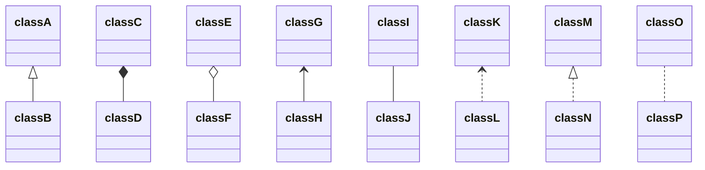

[TOC]

<div STYLE="page-break-after: always;"></div>

# 第4章 对象与类

| $\blacktriangle$ [面向对象程序设计概述](#4.1 面向对象程序设计概述) | $\blacktriangle$ 对象构造   |
| ------------------------------------------------------------ | --------------------------- |
| $\blacktriangle$ [使用预定义类](#4.2 使用预定义类)           | $\blacktriangle$ 包         |
| $\blacktriangle$ 用户自定义类                                | $\blacktriangle$ 类路径     |
| $\blacktriangle$ 静态域与静态方法                            | $\blacktriangle$ 文档注释   |
| $\blacktriangle$ 方法参数                                    | $\blacktriangle$ 类设计技巧 |

这一章将主要介绍如下内容：
* 面向对象程序设计
* 如何创建标准 Java 类库中的类对象
* 如何编写自己的类

## 4.1 面向对象程序设计概述

&emsp;&emsp;面向对象程序设计（简称 OOP) 是当今主流的程序设计范型， 它已经取代了 20 世纪 70年代的“ 结构化” 过程化程序设计开发技术。Java 是完全面向对象的， 必须熟悉 OOP 才能够编写 Java 程序。

&emsp;&emsp;面向对象的程序是由对象组成的， 每个对象包含对用户公开的特定功能部分和隐藏的实现部分。程序中的很多对象来自标准库，还有一些是自定义的。究竟是自己构造对象， 还是从外界购买对象完全取决于开发项目的预算和时间。但是， 从根本上说， 只要对象能够满足要求， 就不必关心其功能的具体实现过程。在 OOP 中， 不必关心对象的具体实现， 只要能够满足用户的需求即可。  

&emsp;&emsp;对于一些规模较小的问题， 将其分解为过程的开发方式比较理想。而面向对象更加适用
于解决规模较大的问题。  

### 4.1.1 类

&emsp;&emsp;==类(class)== 是构造对象的模板或蓝图。 我们可以将类想象成制作小甜饼的切割机，将对象想象为小甜饼。 由类==构造(construct)==对象的过程称为创建类的==实例 (instance)== .

&emsp;&emsp;正如前面所看到的， 用 Java 编写的所有代码都位于某个类的内部: 标准的 Java 库提供了几千个类， 可以用于用户界面设计、日期、 日历和网络程序设计。尽管如此，还是需要在Java 程序中创建一些自己的类， 以便描述应用程序所对应的问题域中的对象。

&emsp;&emsp;==封装(encapsulation，有时称为数据隐藏)==是与对象有关的一个重要概念。 从形式上看，封装不过是将数据和行为组合在一个包中， 并对对象的使用者隐藏了数据的实现方式。对象中的数据称为==实例域(instance field)==, 操纵数据的过程称为==方法(method)==。 对于每个特定的类实例（对象）都有一组特定的实例域值。这些值的集合就是这个对象的当前==状态(state)==。无论何时， 只要向对象发送一个消息，它的状态就有可能发生改变。  

&emsp;&emsp;实现封装的关键在于绝对不能让类中的方法直接地访问其他类的实例域。 程序仅通过对象的方法与对象数据进行交互。封装给对象赋予了==“黑盒”==特征， 这是提高重用性和可靠性的关键。 这意味着一个类可以全面地改变存储数据的方式，只要仍旧使用同样的方法操作数据， 其他对象就不会知道或介意所发生的变化  

&emsp;&emsp;OOP 的另一个原则会让用户自定义 Java 类变得轻而易举， 这就是： 可以通过扩展一个类来建立另外一个新的类。事实上， 在 Java 中， 所有的类都源自于一个“ 神通广大的超类”，它就是 Object。在[下一章](第5章 继承.md)中， 读者将可以看到有关 Object 类的详细介绍。  

&emsp;&emsp;在扩展一个已有的类时， 这个扩展后的新类具有所扩展的类的全部属性和方法。在新类中， 只需提供适用于这个新类的新方法和数据域就可以了。通过扩展一个类来建立另外一个类的过程称为继承(inheritance) ，有关继承的详细内容请参看[下一章](第5章 继承.md)。 

### 4.1.2 对象

要想使用 OOP，—定要清楚对象的三个主要特性：
* 对象的==行为(behavior)==$\longrightarrow$可以对对象施加哪些操作，或可以对对象施加哪些方法？
* 对象的==状态(state)==$\longrightarrow$当施加那些方法时，对象如何响应？
* 对象==标识(identity)==$\longrightarrow$如何辨别具有相同行为与状态的不同对象

&emsp;&emsp;同一个类的所有对象实例， 由于支持相同的行为而具有家族式的相似性。对象的行为是用可调用的方法定义的。  

&emsp;&emsp;此外，每个对象都保存着描述当前特征的信息。这就是对象的状态。对象的状态可能会随着时间而发生改变，但这种改变不会是自发的。 对象状态的改变必须通过调用方法实现（如果不经过方法调用就可以改变对象状态， 只能说明封装性遭到了破坏）。

&emsp;&emsp;但是，对象的状态并不能完全描述一个对象。每个对象都有一个唯一的身份(identity)。

&emsp;&emsp;对象的这些关键特性在彼此之间相互影响着。   

### 4.1.3 识别类

&emsp;&emsp;首先从设计类开始，然后再往每个类中添加方法。

&emsp;&emsp;识别类的简单规则是在分析问题的过程中寻找名词，而方法对应着动词。

### 4.1.4 类之间的关系

在类之间， 最常见的关系有

* ==依赖==    uses-a
* ==聚合==    has-a
* ==继承==    is-a

&emsp;&emsp;==依赖(dependence)==，即“uses-a”关系，是一种最明显的、最常见的关系。  应该尽可能地将相互依赖的类减至最少，让类之间的耦合度最小。

&emsp;&emsp;==聚合(aggregation)==，即“has-a” 关系，是一种具体且易于理解的关系。 

:page_facing_up:**注释**：有些方法学家不喜欢聚合这个概念，而更加喜欢使用“ 关联” 这个术语。从建模的角度看， 这是可以理解的。 但对于程序员来说，"has-a"显得更加形象。喜欢使用聚合的另一个理由是关联的标准符号不易区分， 请参看表 4-1。 

<center>表 4-1 表达类关系的UML符号</center>

| Type   | Description      |
| :----- | :--------------- |
| `<|--` | 继承关系         |
| `*--`  | 组合关系         |
| `o--`  | 聚合关系         |
| `-->`  | （直接）关联关系 |
| `--`   | 实现连接（关联） |
| `..>`  | 依赖关系         |
| `..|>` | （接口）实现关系 |
| `..`   | 虚线连接         |



&emsp;&emsp;==继承(inheritance)==, 即"is-a"关系，是一种用于表示特殊与一般关系的。 一般而言，如果类 A 扩展类 B，类 A 不但包含从类 B 继承的方法，还会拥有一些额外的功能。

## 4.2 使用预定义类

### 4.2.1 对象与对象变量

&emsp;&emsp;要想使用对象，就必须首先构造对象， 并指定其初始状态。然后，Xt对象应用方法。在 Java 程序设计语言中， 使用构造器（constructor) 构造新实例。 构造器是一种特殊的 方法，用来构造并初始化对象。

&emsp;&emsp;构造器的名字应该与类名相同。 

&emsp;&emsp;通常， 希望构造的对象可以多次使用， 因此，需要将对象存放在一个变量中。  

&emsp;&emsp;一个对象变量并没有实际包含一个对象，而仅仅引用一个对象 。

&emsp;&emsp;==在 Java 中，任何对象变量的值都是对存储在另外一个地方的一个对象的引用。new 操作符的返回值也是一个引用。==

&emsp;&emsp;局部变量不会自动地初始化为 null，而必须通过调用 new 或将它们设置为 null 进行初始化。 

### 4.2.2 Java类库中的LocalDate类

&emsp;&emsp;尽管在使用 Date 类时不必知道这一点，但时间是用距离一个固定时间点的毫秒数（可正可负）表示的， 这个点就是所谓的纪元（epoch), 它 是 UTC 时间 1970 年 1 月 1 日 00:00:00。UTC 是 Coordinated Universal Time 的缩写，与大家熟悉的 GMT (即 Greenwich Mean Time 格林威治时间）一样，是一种具有实践意义的科学标准时间。

&emsp;&emsp;类库设计者决定将保存时间与给时间点命名分开。所以标准 Java 类库分别包含了两个类：一个是用来表示时间点的 Date 类；另一个是用来表示大家熟悉的日历表示法的 LocalDate 类。Java SE 8弓丨入了另外一些类来处理日期和时间的不同方面一有关内容参见卷 II 第 6 章。

&emsp;&emsp;将时间与日历分开是一种很好的面向对象设计。通常，最好使用不同的类表示不同的概念。

&emsp;&emsp;不要使用构造器来构造 LocalDate 类的对象。实际上，应当使用静态工厂方法 (factory method) 代表你调用构造器。下面的表达式

&emsp;&emsp;`LocalDate.now()`

会构造一个新对象， 表示构造这个对象时的日期。

&emsp;&emsp;可以提供年、 月和日来构造对应一个特定日期的对象：

&emsp;&emsp;`LocalDate.of(1999, 12, 31)`

&emsp;&emsp;当然， 通常都希望将构造的对象保存在一个对象变量中：

&emsp;&emsp;`LocalDate newYearsEve = LocalDate.of(1999, 12, 31);`

&emsp;&emsp;一旦有了一个 LocalDate 对象， 可以用方法 getYear、 getMonthValue 和 getDayOfMonth得到年、月和日：
&emsp;&emsp;`int year = newYearsEve.getYearO; // 1999`
&emsp;&emsp;`int month = newYearsEve.getMonthValueO; // 12`
&emsp;&emsp;`int day = newYearsEve.getDayOfMonth(); // 31 ` 

&emsp;&emsp;LocalDate 类封装了实例域来维护所设置的日期。如果不查看源代码， 就不可能知道类内部的日期表示。当然， 封装的意义在于，这一点并不重要， 重要的是类对外提供的方法。

:page_facing_up:注释：实际上，Date 类还有 getDay、getMonth 以及 getYear 等方法，然而并不推荐使用这些方法。 当类库设计者意识到某个方法不应该存在时， 就把它标记为不鼓励使用。
&emsp;&emsp;类库设计者意识到应当单独提供类来处理日历， 不过在此之前这些方法已经是 Date类的一部分了。Java 1.1 中引入较早的一组日历类时，Date 方法被标为废弃不用。 虽然仍然可以在程序中使用这些方法， 不过如果这样做， 编译时会出现警告。 最好还是不要使用这些废弃不用的方法， 因为将来的某个类库版本很有可能将它们完全删除。

### 4.2.3 更改器方法与访问器方法

&emsp;&emsp;调用某个方法后，对象的状态会改变，称这个方法是一个更改器方法 (mutator  method) 

&emsp;&emsp;只访问对象而不修改对象的方法有时称为访问器方法 (accessor method)

==程序清单 4-1 CalendarTest/CalendarTest.java==

```java
package CalendarTest;

import java.time.DayOfWeek;
import java.time.LocalDate;

/**
 * @author Cay Horstmann
 * @version 1.5 2015-05-08
 */
public class CalendarTest {
    public static void main(String[] args) {
        LocalDate date = LocalDate.now();
        int month = date.getMonthValue();
        int today = date.getDayOfMonth();

        date = date.minusDays(today - 1); // Set to start of month
        DayOfWeek weekday = date.getDayOfWeek();
        int value = weekday.getValue(); // 1 = Monday, ... 7 = Sunday

        System.out.println("Mon Tue Wed Thu Fri Sat Sun");
        for (int i = 1; i < value; i++) {
            System.out.println("    ");
        }

        while (date.getMonthValue() == month) {
            System.out.printf("%3d", date.getDayOfMonth());
            if (date.getDayOfMonth() == today) {
                System.out.print("*");
            } else {
                System.out.print(" ");
            }
            date = date.plusDays(1);
            if (date.getDayOfWeek().getValue() == 1)
                System.out.println();
        }

        if (date.getDayOfWeek().getValue() != 1)
            System.out.println();
    }
}
```

## 4.3 用户自定义类

&emsp;&emsp;通常，这些类没有main方法，却有自己的实例域和实例方法。要想创建一个完整的程序，应该将若干类组合在一起，其中只有一个类有main方法。

### 4.3.1 Employee类

&emsp;&emsp;在Java中，最简单的类定义形式为：

```java
class ClassName {
    field1;
    field2;
    ....;
    constructor1;
    constructor2;
    ...;
    method1;
    method2;
}
```

==程序清单4-2 EmployeeTest/EmployeeTest.java==

```java
package EmployeeTest;

import java.time.LocalDate;

/**
 * This program tests the chapter04.EmployeeTest.EmployeeTest class.
 *
 * @author Cay Horstmann
 * @version 1.12 2015-05-08
 */
public class EmployeeTest {
    public static void main(String[] args) {
        // fill the staff array with three chapter04.EmployeeTest.EmployeeTest objects
        Employee[] staff = new Employee[3];

        staff[0] = new Employee("Carl Cracker", 75000, 1987, 12, 15);
        staff[1] = new Employee("Harry Hacker", 50000, 1989, 10, 1);
        staff[2] = new Employee("Tony Tester", 40000, 1990, 3, 15);

        // raise everyone's salary by 5%
        for (Employee employee : staff)
            employee.raiseSalary(5);
        // print out information about all EmployeeTest objects
        for (Employee employee : staff) {
            System.out.println("name = " + employee.getName() +
                    ", salary = " + employee.getSalary() +
                    ", hireDay = " + employee.getHireDay()
            );
        }
    }
}

class Employee {
    private final String name;
    private final LocalDate hireDay;
    private double salary;

    public Employee(String name, double salary, int year, int month, int day) {
        this.name = name;
        this.salary = salary;
        hireDay = LocalDate.of(year, month, day);
    }

    public String getName() {
        return name;
    }

    public double getSalary() {
        return salary;
    }

    public LocalDate getHireDay() {
        return hireDay;
    }

    public void raiseSalary(double byPercent) {
        double raise = salary * byPercent / 100;
        salary += raise;
    }
}
```

&emsp;&emsp;文件名必须与public类的名字相匹配。在一个源文件中，只能有一个公有类，但可以有任意数目的非公有类。

### 4.3.2 多个源文件的使用

&emsp;&emsp;在程序清单4-2中，一个源文件包含了两个类。许多程序员习惯于将每一个类存在一个单独的源文件中。

&emsp;&emsp;如果喜欢这样组织文件，将可以有两种编译源程序的方法。一种是使用通配符调用Java编译器：

&emsp;&emsp;`javac Emloyee*.java`

于是，所有与通配符匹配的源文件都将被编译成类文件。或者键入下列命令：

&emsp;&emsp;`javac EmployeeTest.java`

### 4.3.3 剖析Employee类

&emsp;&emsp;关键字`public`意味着任何类的任何方法都可以调用这些方法（共有4种访问级别，将在本章稍后和下一章中介绍）。

&emsp;&emsp;关键字`private`确保只有Employee类自身的方法能够访问这些实例域，而其他类的方法不能够读写这些域。

:page_facing_up:注释：可以用public标记实例域，但这是一种极为不提倡的做法。public数据域允许程序中的任何方法对其进行读取和修改。这就完全破坏了封装。任何类的任何方法都可以修改public域，从我们的经验来看，某些代码将使用这种存取权限，而这并不我们所希望的，因此，这里强烈建议将实例域标记为private。

&emsp;&emsp;最后，请注意，类通常包括类型属于某个类类型的实例域。

### 4.3.4 从构造器开始

&emsp;&emsp;构造器与其他的方法有一个重要的不同。构造器总是伴随着new操作符的执行被调用，而不能对一个已经存在的对象调用构造器来达到重新设置实例域的目的。

本章稍后还会更加详细地介绍有关构造器的内容。现在只需要记住：

* 构造器与类同名
* 每个类可以有一个以上的构造器
* 构造器可以有0个、1个或多个参数·构造器没有返回值
* 构造器总是伴随着new操作一起调用

:warning:警告：请注意，不要在构造器中定义与实例域重名的局部变量。

### 4.3.5 隐式参数与显式参数

&emsp;&emsp;显式参数(explicit)是明显地列在方法声明中的，隐式参数(implicit)没有出现在方法声明中。

&emsp;&emsp;在每一个方法中，关键字this表示隐式参数。有些程序员更偏爱这样的风格，因为这样可以将实例域与局部变量明显地区分开来。

### 4.3.6 封装的优点

在有些时候，需要获得或设置实例域的值。因此，应该提供下面三项内容：

* 一个私有的数据域
* 一个公有的域访问器方法
* 一个公有的域更改器方法

&emsp;&emsp;这样做要比提供一个简单的公有数据域复杂些，但是却有着下列明显的好处：

&emsp;&emsp;首先，可以改变内部实现，除了该类的方法之外，不会影响其他代码。

&emsp;&emsp;当然，为了进行新旧数据表示之间的转换，访问器方法和更改器方法有可能需要做许多工作。但是，这将为我们带来了第二点好处：更改器方法可以执行错误检查，然而直接对域进行赋值将不会进行这些处理。

:warning:警告：注意不要编写返回引用可变对象的访问器方法。如果需要返回一个可变对象的引用，应该首先对它进行克隆(clone)。对象clone是指存放在另一个位置上的对象副本。

### 4.3.7 基于类的访问权限

&emsp;&emsp;方法可以访问所调用对象的私有数据。一个方法可以访问所属类的所有对象的私有数据。

### 4.3.8 私有方法

&emsp;&emsp;在Java中，为了实现一个私有的方法，只需将关键字`public`改为`private`即可。

&emsp;&emsp;只要方法是私有的，它不会被外部的其他类操作调用，可以将其删去。如果方法是公有的，就不能将其删去，因为其他的代码很可能依赖它。

### 4.3.9 final实例域

&emsp;&emsp;可以将实例域定义为`final`。构建对象时必须初始化这样的域。也就是说，必须确保在每一个构造器执行之后，这个域的值被设置，并且在后面的操作中，不能够再对它进行修改。

&emsp;&emsp;final修饰符大都应用于基本(primitive)类型域，或不可变(immutable)类的域（如果类中的每个方法都不会改变其对象，这种类就是不可变的类。例如，String类就是一个不可变的类）。

## 4.4 静态域与静态方法

&emsp;&emsp;main方法都被标记为static修饰符。下面讨论一下这个修饰符的含义。

### 4.4.1 静态域

&emsp;&emsp;如果将域定义为static，每个类中只有一个这样的域。而每一个对象对于所有的实例域却都有自己的一份拷贝。

:page_facing_up:注释：在绝大多数的面向对象程序设计语言中，静态域被称为类域。

### 4.4.2 静态常量

&emsp;&emsp;静态变量使用得比较少，但静态常量却使用得比较多。

:page_facing_up:注释：如果查看一下System类，就会发现有一个setOut方法，它可以将System.out设置为不同的流，可以修改final变量的值。setOut方法是一个本地方法，而不是用Java语言实现的。

### 4.4.3 静态方法

&emsp;&emsp;静态方法是一种不能向对象实施操作的方法。可以认为静态方法是没有this参数的方法。静态方法可以访问自身类中的静态域。

:page_facing_up:注释：可以使用对象调用静态方法。

### 4.4.4 工厂方法

&emsp;&emsp;静态方法还有另外一种常见的用途。使用静态工厂方法（factory method）来构造对象。

### 4.4.5 main方法

&emsp;&emsp;需要注意，不需要使用对象调用静态方法。main方法不对任何对象进行操作。事实上，在启动程序时还没有任何一个对象。静态的main方法将执行并创建程序所需要的对象。

:heavy_check_mark:提示：每一个类可以有一个main方法。这是一个常用于对类进行单元测试的技巧。

程序清单4-3中的程序包含了Employee类的一个简单版本，其中有一个静态域nextId和一个静态方法getNextId。这里将三个Employee对象写入数组，然后打印雇员信息。最后，打印出下一个可用的员工标识码来展示静态方法。

```java
package StaticTest;

/**
 * This program demonstrates static methods.
 *
 * @author Cay Horstmann
 * @version 1.01 2004-02-19
 */
public class StaticTest {
    public static void main(String[] args) {
        // fill the staff array with three EmployeeTest objects
        Employee[] staff = new Employee[3];

        staff[0] = new Employee("Tom", 75000);
        staff[1] = new Employee("Disk", 50000);
        staff[2] = new Employee("Harry", 40000);

        // print out information about all EmployeeTest objects
        for (Employee employee2 : staff) {
            employee2.setId();
            System.out.println("name = " + employee2.getName() + ", id = " + employee2.getId() + ", salary = "
                    + employee2.getSalary());
        }
    }
}

class Employee {
    private static int nextId = 1;

    private final String name;
    private final double salary;
    private int id;

    public Employee(String name, double salary) {
        this.name = name;
        this.salary = salary;
        id = 0;
    }

    public static int getNextId() {
        return nextId;   // returns static field
    }

    // unit test
    public static void main(String[] args) {
        Employee employee2 = new Employee("Harry", 50000);
        System.out.println(employee2.getName() + " " + employee2.getSalary());
    }

    public String getName() {
        return name;
    }

    public double getSalary() {
        return salary;
    }

    public int getId() {
        return id;
    }

    public void setId() {
        id = nextId;    // set id to next available id
        nextId++;
    }
}
```

&emsp;&emsp;需要注意，Employee类也有一个静态的main方法用于单元测试。试试运行:
&emsp;&emsp;`java Employee`

和
&emsp;&emsp;`java StaticTest`

执行两个main方法。

## 4.5 方法参数

&emsp;&emsp;按值调用（call by value）表示方法接收的是调用者提供的值。而按引用调用（call by reference）表示方法接收的是调用者提供的变量地址。一个方法可以修改传递引用所对应的变量值，而不能修改传递值调用所对应的变量值。

&emsp;&emsp;Java程序设计语言总是采用`按值调用`。也就是说，方法得到的是所有参数值的一个拷贝，特别是，方法不能修改传递给它的任何参数变量的内容。

&emsp;&emsp;然而，方法参数共有两种类型：

* 基本数据类型（数字、布尔值）。
* 对象引用。

&emsp;&emsp;下面总结一下Java中方法参数的使用情况：

* 一个方法不能修改一个基本数据类型的参数（即数值型或布尔型）。
* 一个方法可以改变一个对象参数的状态。
* 一个方法不能让对象参数引用一个新的对象。

==程序清单4-4 ParamTest/ParamTest.java==

```
package ParmTest;

/**
 * This program demonstrates parameter passing in Java.
 *
 * @author Cay Horstmann
 * @version 1.00 2000-01-27
 */
public class ParamTest {
    public static void main(String[] args) {
        /*
         * Test 1: Methods can't modify numeric parameters
         */
        System.out.println("Testing tripleValue:");
        double percent = 10;
        System.out.println("Before percent = " + percent);
        tripleValue(percent);
        System.out.println("After percent = " + percent);

        /*
         *  Test 2: Methods can change the state of object parameters
         */
        System.out.println("\nTesting tripleSalary:");
        Employee harry = new Employee("Harry", 50000);
        System.out.println("Before salary = " + harry.getSalary());
        tripleValue(harry);
        System.out.println("After: salary = " + harry.getSalary());

        /*
         * Test 3: Methods can't attach new objects to object parameters
         */
        System.out.println("\nTesting swap");
        Employee a = new Employee("Alice", 70000);
        Employee b = new Employee("Bob", 60000);
        System.out.println("Before a = " + a.getName());
        System.out.println("Before b = " + b.getName());
        swap(a, b);
        System.out.println("After: a = " + a.getName());
        System.out.println("After: b = " + b.getName());
    }

    // doesn't work
    public static void tripleValue(double x) {
        x = 3 * x;
        System.out.println("End of method: x = " + x);
    }

    // works
    public static void tripleValue(Employee x) {
        x.raiseSalary(200);
        System.out.println("End of method: salary = " + x.getSalary());
    }

    public static void swap(Employee x, Employee y) {
        Employee temp = x;
        x = y;
        y = temp;
        System.out.println("End of method: x = " + x.getName());
        System.out.println("End of method: y = " + y.getName());
    }
}

// simplified EmployeeTest class
class Employee {
    private final String name;
    private double salary;

    public Employee(String name, double salary) {
        this.name = name;
        this.salary = salary;
    }

    public String getName() {
        return name;
    }

    public double getSalary() {
        return salary;
    }

    public void raiseSalary(double byPercent) {
        double raise = salary * byPercent / 100;
        salary += raise;
    }
}
```

## 4.6 对象构造

### 4.6.1 重载

&emsp;&emsp;如果多个方法有相同的名字、不同的参数，便产生了==重载(overloading)==。编译器必须挑选出具体执行哪个方法，它通过用各个方法给出的参数类型与特定方法调用所使用的值类型进行匹配来挑选出相应的方法。如果编译器找不到匹配的参数，就会产生编译时错误，因为根本不存在匹配，或者没有一个比其他的更好。（这个过程被称为重载解析(overloading resolution))。

:page_facing_up:注释：Java允许重载任何方法，而不只是构造器方法。因此，要完整地描述一个方法，需要指出方法名以及参数类型。

### 4.6.2 默认域初始化

&emsp;&emsp;如果在构造器中没有显式地给域赋予初值，那么就会被自动地赋为默认值：数值为0、布尔值为false、对象引用为null。然而，只有缺少程序设计经验的人才会这样做。确实，如果不明确地对域进行初始化，就会影响程序代码的可读性。

:page_facing_up:注释：这是域与局部变量的主要不同点。必须明确地初始化方法中的局部变量。但是，如果没有初始化类中的域，将会被自动初始化为默认值（0、false或null）。

### 4.6.3 无参数的构造器

&emsp;&emsp;很多类都包含一个无参数的构造函数，对象由无参数构造函数创建时，其状态会设置为适当的默认值。

&emsp;&emsp;如果在编写一个类时没有编写构造器，那么系统就会提供一个无参数构造器。这个构造器将所有的实例域设置为默认值。于是，实例域中的数值型数据设置为0、布尔型数据设置为false、所有对象变量将设置为null。

&emsp;&emsp;如果类中提供了至少一个构造器，但是没有提供无参数的构造器，则在构造对象时如果没有提供参数就会被视为不合法。

:warning:警告：请记住，仅当类没有提供任何构造器的时候，系统才会提供一个默认的构造器。如果在编写类的时候，给出了一个构造器，哪怕是很简单的，要想让这个类的用户能够采用下列方式构造实例：
&emsp;&emsp;`new ClassName()`

就必须提供一个默认的构造器（即不带参数的构造器）。当然，如果希望所有域被赋予默认值，可以采用下列格式：
&emsp;&emsp;`public ClassName() {`  
&emsp;&emsp;`}`

### 4.6.4 显式域初始化

&emsp;&emsp;通过重载类的构造器方法，可以采用多种形式设置类的实例域的初始状态。确保不管怎样调用构造器，每个实例域都可以被设置为一个有意义的初值，这是一种很好的设计习惯。

&emsp;&emsp;可以在类定义中，直接将一个值赋给任何域。

&emsp;&emsp;在执行构造器之前，先执行赋值操作。当一个类的所有构造器都希望把相同的值赋予某个特定的实例域时，这种方式特别有用。

&emsp;&emsp;初始值不一定是常量值。在下面的例子中，可以调用方法对域进行初始化。

### 4.6.5 参数名

&emsp;&emsp;在编写很小的构造器时（这是十分常见的），常常在参数命名上出现错误。

&emsp;&emsp;通常，参数用单个字符命名。但这样做有一个缺陷：只有阅读代码才能够了解参数n和参数s的含义。

&emsp;&emsp;有些程序员在每个参数前面加上一个前缀“a”，这样很清晰。每一个读者一眼就能够看懂参数的含义。

&emsp;&emsp;还一种常用的技巧，它基于这样的事实：参数变量用同样的名字将实例域屏蔽起来。

### 4.6.6 调用另一个构造器

&emsp;&emsp;关键字`this`引用方法的隐式参数。然而，这个关键字还有另外一个含义。

&emsp;&emsp;如果构造器的第一个语句形如`this(...)`，这个构造器将调用同一个类的另一个构造器。

&emsp;&emsp;采用这种方式使用this关键字非常有用，这样对公共的构造器代码部分只编写一次即可。

### 4.6.7 初始化块

&emsp;&emsp;前面已经讲过两种初始化数据域的方法：

* 在构造器中设置值

* 在声明中赋值

&emsp;&emsp;实际上，Java还有第三种机制，称为初始化块（initializationblock）。在一个类的声明中，可以包含多个代码块。只要构造类的对象，这些块就会被执行。这种机制不是必需的，也不常见。通常会直接将初始化代码放在构造器中。

:page_facing_up:注释：即使在类的后面定义，仍然可以在初始化块中设置域。但是，为了避免循环定义，不要读取在后面初始化的域。

&emsp;&emsp;当然，应该精心地组织好初始化代码，这样有利于其他程序员的理解。例如，如果让类的构造器行为依赖于数据域声明的顺序，那就会显得很奇怪并且容易引起错误。

&emsp;&emsp;可以通过提供一个初始化值，或者使用一个静态的初始化块来对静态域进行初始化。

&emsp;&emsp;如果对类的静态域进行初始化的代码比较复杂，那么可以使用静态的初始化块。将代码放在一个块中，并标记关键字static。在类第一次加载的时候，将会进行静态域的初始化。与实例域一样，除非将它们显式地设置成其他值，否则默认的初始值是0、false或null。所有的静态初始化语句以及静态初始化块都将依照类定义的顺序执行。

:page_facing_up:注释：让人惊讶的是，在JDK 6之前，都可以用Java编写一个没有main方法的“Hello，World”程序。从Java SE 7以后，java程序首先会检查是否有一个main方法。

程序清单4-5中的程序展示了本节讨论的很多特性：
&emsp;&emsp;重载构造器
&emsp;&emsp;用this(...)
&emsp;&emsp;调用另一个构造器
&emsp;&emsp;无参数构造器
&emsp;&emsp;对象初始化块
&emsp;&emsp;静态初始化块
&emsp;&emsp;实例域初始化

```java
package ConstructorTest;

import java.util.Random;

/**
 * This program demonstrates object construction,
 *
 * @author Cay Horstmann
 * @version 1.01 2004-02-19
 */
public class ConstructorTest {
    public static void main(String[] args) {
        // fill the staff array with three EmployeeTest objects
        Employee[] staff = new Employee[3];

        staff[0] = new Employee("Harry", 40000);
        staff[1] = new Employee(60000);
        staff[2] = new Employee();

        // print out information about all EmployeeTest objects
        for (Employee employee : staff) {
            System.out.println("name = " + employee.getName() + ", id = " + employee.getId() + ", salary = " + employee.getSalary());
        }
    }
}

class Employee {
    private static int nextId;

    // static initialization block
    static {
        Random generator = new Random();
        // set nextId to a random number between 0 and 9999
        nextId = generator.nextInt(10000);
    }

    private final int id;
    private String name = "";   // instance field initialization
    private double salary;

    // object initialization block
    {
        id = nextId;
        nextId++;
    }

    public Employee(String name, double salary) {
        this.name = name;
        this.salary = salary;
    }

    // the default constructor
    public Employee() {
        // name initialized to "" see above
        // salary not explicitly set initialized to 0
        // id initialized in initialization block
    }

    public Employee(double salary) {
        // calls the EmployeeTest(String, double) constructor
        this("EmployeeTest #" + nextId, salary);
    }

    public String getName() {
        return name;
    }

    public double getSalary() {
        return salary;
    }

    public int getId() {
        return id;
    }
}
```

==$\colorbox{white}{API}$java.util.Random 1.0==

| 代码 <br />说明 |
| -------------- |
| `Random()`<br />构造一个新的随机数生成器。 |
| `nextInt(int bound)` 1.2<br />返回一个0~n-1之间的随机数。 |

### 4.6.8 对象析构与finalize方法

&emsp;&emsp;Java有自动的垃圾回收器，不需要人工回收内存，所以Java不支持析构器。

&emsp;&emsp;当然，某些对象使用了内存之外的其他资源，例如，文件或使用了系统资源的另一个对象的句柄。在这种情况下，当资源不再需要时，将其回收和再利用将显得十分重要。

&emsp;&emsp;可以为任何一个类添加`finalize`方法。`finalize`方法将在垃圾回收器清除对象之前调用。在实际应用中，不要依赖于使用`finalize`方法回收任何短缺的资源，这是因为很难知道这个方法什么时候才能够调用。

:page_facing_up:注释：有个名为`System.runFinalizersOnExit(true)`的方法能够确保finalizer方法在Java关闭前被调用。不过，这个方法并不安全，也不鼓励大家使用。有一种代替的方法是使用方法`Runtime.addShutdownHook`添加“关闭钩”（`shutdownhook`），详细内容请参看API文档。

&emsp;&emsp;如果某个资源需要在使用完毕后立刻被关闭，那么就需要由人工来管理。对象用完时，可以应用一个close方法来完成相应的清理操作。

## 4.7 包

&emsp;&emsp;Java允许使用包（`package`）将类组织起来。借助于包可以方便地组织自己的代码，并将自己的代码与别人提供的代码库分开管理。

&emsp;&emsp;标准的Java类库分布在多个包中，包括`java.lang`、`java.util`和`java.net`等。标准的Java包具有一个层次结构。如同硬盘的目录嵌套一样，也可以使用嵌套层次组织包。所有标准的Java包都处于java和javax包层次中。

&emsp;&emsp;使用包的主要原因是确保类名的唯一性。事实上，为了保证包名的绝对唯一性，Sun公司建议将公司的因特网域名（这显然是独一无二的）以逆序的形式作为包名，并且对于不同的项目使用不同的子包。

&emsp;&emsp;从编译器的角度来看，嵌套的包之间没有任何关系。例如，java.util包与java.util.jar包毫无关系。每一个都拥有独立的类集合。

### 4.7.1 类的导入

&emsp;&emsp;一个类可以使用所属包中的所有类，以及其他包中的公有类（public class）。我们可以采用两种方式访问另一个包中的公有类。第一种方式是在每个类名之前添加完整的包名。

&emsp;&emsp;这显然很繁琐。更简单且更常用的方式是使用import语句。import语句是一种引用包含在包中的类的简明描述。一旦使用了import语句，在使用类时，就不必写出包的全名了。

&emsp;&emsp;可以使用import语句导入一个特定的类或者整个包。import语句应该位于源文件的顶部（但位于package语句的后面）。需要注意的是，只能使用星号（*）导入一个包，

&emsp;&emsp;如果能够明确地指出所导入的类，将会使代码的读者更加准确地知道加载了哪些类。

### 4.7.2 静态导入

&emsp;&emsp;import语句不仅可以导入类，还增加了导入静态方法和静态域的功能。

### 4.7.3 将类放入包中

